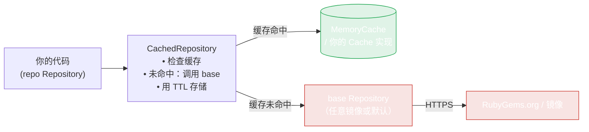
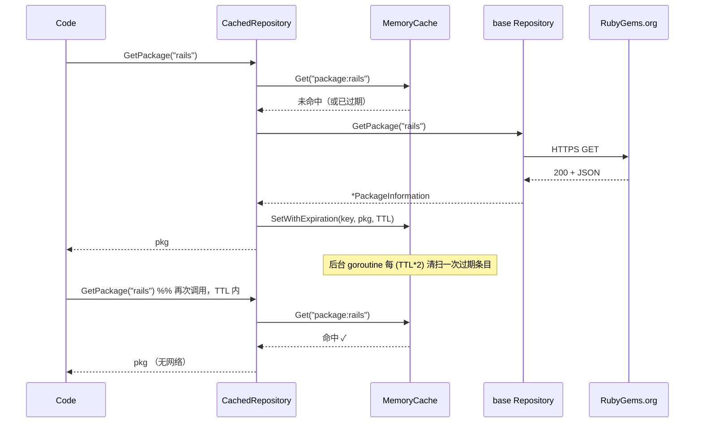

# 缓存

RubyGems.org 对未认证流量限流。对同一 gem 的重复查询消耗配额并增加延迟。`CachedRepository` 是一个直接可用的缓存装饰器，用 TTL 缓存结果。

## 快速开始

```go
import (
    "time"
    "github.com/scagogogo/rubygems-skills/pkg/repository"
)

base   := repository.NewRubyChinaRepository()
cached := repository.NewCachedRepository(base, 10*time.Minute, nil)

// 第一次调用走网络；第二次命中缓存。
pkg1, _ := cached.GetPackage(ctx, "rails")
pkg2, _ := cached.GetPackage(ctx, "rails")
```

`cached` 是完整的 `Repository` —— 每个读方法都被包装。任何接受 `Repository` 的地方都能传它；其他代码不变。

## 装饰器模式

`CachedRepository` 实现了与被包装对象相同的 `Repository` 接口。你的代码面向接口编程，所以把原始 repo 换成缓存 repo 是一行改动，下游无需编辑：



缓存键按方法划分且人类可读 —— `package:<gem>`、`search:<query>:<page>`、`versions:<gem>`、`dependencies:<逗号连接的名字>` 等（见 `pkg/repository/cached_repository.go`）。键按方法命名空间隔离，所以 `GetPackage("rails")` 和 `Search("rails", 1)` 永不冲突。

## TTL 与过期



有两个 TTL：

- **单条目 TTL** —— 传给 `NewCachedRepository`。决定每个缓存值何时过期。
- **清扫间隔** —— 内置 `MemoryCache` 启动一个后台 goroutine，每 `TTL*2` 删除过期条目（传入你自己的 `cache.Cache` 可独立控制）。

某些读方法对变化更频繁的数据用更短的 TTL（`defaultTTL/2`）—— 搜索结果、下载量、版本详情 —— 在不失去限流收益的同时保证新鲜度。过期条目也会在 `Get` 时惰性淘汰（即使清扫器还没运行，过期条目也返回未命中）。

`Close()` 停止清扫 goroutine —— 关闭时调用以避免泄漏定时器。

## 构造函数

```go
func NewCachedRepository(repo Repository, ttl time.Duration, cacheImpl cache.Cache) *CachedRepository
```

| 参数 | 含义 |
|---|---|
| `repo` | 被包装的底层 `Repository`（任意镜像或默认）。 |
| `ttl` | 每个条目保持有效的时间。 |
| `cacheImpl` | 自定义缓存实现，或 `nil` 用内置内存缓存。 |

## 哪些会被缓存

所有读端点：`GetPackage`、`Search`、`GetGemVersions`、`GetDependencies`、`TopDownloads`、`GetUserProfile`、`GetGemOwners`、`GetAttestations`，以及 `Repository` 接口的其余方法。批量操作透传给底层 repo（它们已经是并发的）。

## 缓存控制

```go
// 清空所有
cached.ClearCache()

// 查看大小
n := cached.GetCacheStats()

// 关闭时清理定时器
cached.Close()
```

## 自定义缓存

实现 `cache.Cache` 接口，把缓存后端换成 Redis、memcached 或文件存储：

```go
type Cache interface {
    Get(key string) (interface{}, bool)
    Set(key string, value interface{})
    SetWithExpiration(key string, value interface{}, d time.Duration)
    Delete(key string)
    Clear()
    Count() int
    Close()
}
```

`Set` 用实现的默认过期时间；`SetWithExpiration` 让你按条目覆盖（负 duration 表示「永不过期」）。见 `pkg/cache/cache.go` —— 内置 `MemoryCache` 是参考实现。

把你的实现作为第三个参数传入：

```go
cached := repository.NewCachedRepository(base, 10*time.Minute, myRedisCache)
```

## 何时不该缓存

- **写工作流** —— `WriteRepository` 操作绕过缓存，直接打实时 API（正确，因为 push/yank 必须实时）。
- **极短 TTL** —— 如果你的 TTL 低于典型请求延迟，缓存只增加开销无收益。改用原始 `Repository`。
- **对过期敏感的读取** —— 如果你需要在发布后立刻拿到绝对最新版本，直接调用底层 `repo` 或先 `ClearCache()`。

---

下一步：[重试与退避](./retry)。
