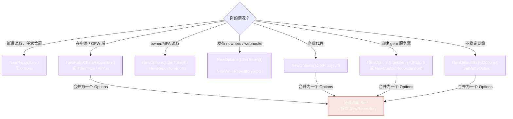

# 配置

一切通过 `Options` 构建器配置。只有需要改默认值时才用 options 构建 `Repository`（或 `WriteRepository`）—— 无认证、无镜像的读取不需要。

## Options 构建器

```go
opts := repository.NewOptions().
    SetServerURL("https://rubygems.org").
    SetToken("YOUR_API_TOKEN").
    SetProxy("http://127.0.0.1:7890").
    SetRetryOptions(retry)

repo := repository.NewRepository(opts)
```

| 方法 | 用途 | 默认值 |
|---|---|---|
| `SetServerURL(url)` | 指向镜像或自建 gem 服务器 | `https://rubygems.org` |
| `SetToken(token)` | API token —— 提高限流阈值，启用 owner/webhook 读取 | 无 |
| `SetProxy(proxy)` | 企业网络的 HTTP/HTTPS 代理 URL | 无 |
| `SetRetryOptions(r)` | 精调重试/退避 | 3 次尝试，指数退避（1s → 30s），重试任何错误 |
| `DisableRetry()` | 完全关闭重试 | 重试开启 |

## 认证读取

某些读端点（`GetOwnedGems`、`GetMFAStatus`）需要 token（以 `Authorization` header 发送）。传入你的 token：

```go
opts := repository.NewOptions().SetToken("YOUR_API_TOKEN")
repo := repository.NewRepository(opts)
gems, err := repo.GetOwnedGems(ctx)
```

对于 `GetMyProfile`（返回认证用户的完整 profile），用 `WriteRepository` 方法并传入用户名 + 密码 —— 见 [WriteRepository](../api/write-repository)。

从 [rubygems.org → Edit settings → API key](https://rubygems.org/profile/edit) 获取 token。

## 自定义 gem 服务器

指向自建或 Artifactory gem 服务器：

```go
opts := repository.NewOptions().SetServerURL("https://gems.corp.internal")
repo := repository.NewRepository(opts)
```

或用镜像构造函数 —— 它们设置 URL，其他保持默认：

```go
repo := repository.NewRubyChinaRepository()
```

## 代理

在企业代理后？设置一次：

```go
opts := repository.NewOptions().SetProxy("http://10.0.0.1:8080")
```

## 重试调优

```go
retry := repository.NewDefaultRetryOptions().
    WithMaxAttempts(6).
    WithWaitTime(200 * time.Millisecond).
    WithMaxWaitTime(5 * time.Second).
    WithExponentialBackoff(true)

opts := repository.NewOptions().SetRetryOptions(retry)
```

完整说明见 [重试与退避](./retry)。

## 按场景选择配置



每个 `Set*` 返回同一个 `*Options`，所以链式调用适用的配置，然后传给构造函数 —— 见下方合并示例。

## 合并所有配置

```go
retry := repository.NewDefaultRetryOptions().WithMaxAttempts(6)
opts := repository.NewOptions().
    SetServerURL("https://gems.ruby-china.com").
    SetToken("YOUR_API_TOKEN").
    SetProxy("http://127.0.0.1:7890").
    SetRetryOptions(retry)

repo  := repository.NewRepository(opts)
write := repository.NewWriteRepository(opts)  // 写操作需要 *Options
```

`NewWriteRepository` 接受非可变参数 `*Options`（写操作总是需要认证），所以先构建 options 再传入。

---

下一步：[镜像](./mirrors)。
