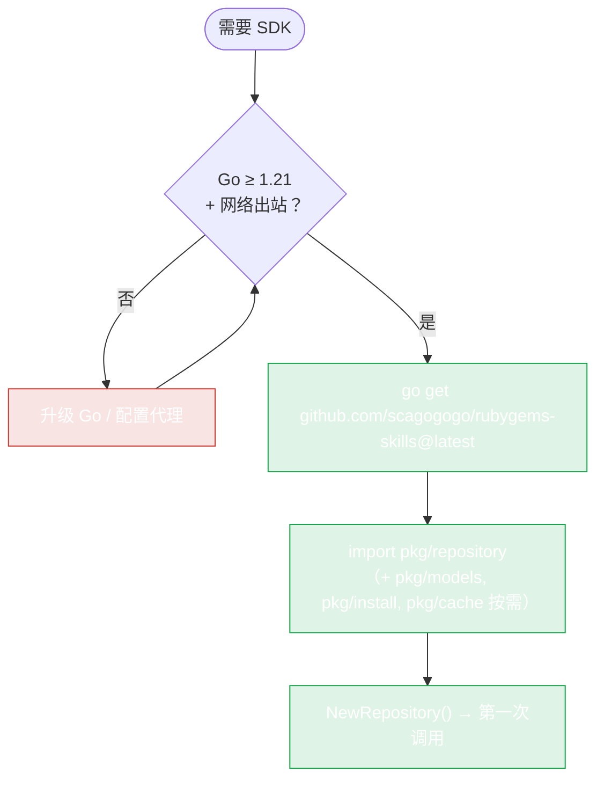

# 安装



使用 SDK 不需要 Ruby/RubyGems 运行时 —— 只有调用 `pkg/install` 自动安装器或自己运行 `gem`/`ruby` 时才需要。

## 要求

- **Go 1.21 或更新**（SDK 使用泛型）。
- 能访问 `rubygems.org` 或镜像（Ruby China、清华、阿里云）。

## 添加依赖

```bash
go get github.com/scagogogo/rubygems-skills@latest
```

这会把 module 加入你的 `go.mod`：

```
require github.com/scagogogo/rubygems-skills v0.x.x
```

## 导入需要的包

```go
import (
    "context"

    "github.com/scagogogo/rubygems-skills/pkg/repository"
    "github.com/scagogogo/rubygems-skills/pkg/models"
)
```

| 包 | 用途 |
|---|---|
| `pkg/repository` | 读写 API |
| `pkg/models` | API 返回的数据结构体 |
| `pkg/install` | 在主机上自动安装 Ruby/RubyGems |
| `pkg/cache` | 自定义缓存实现 |

## 验证工作

```go
package main

import (
    "context"
    "fmt"
    "log"

    "github.com/scagogogo/rubygems-skills/pkg/repository"
)

func main() {
    repo := repository.NewRepository()
    pkg, err := repo.GetPackage(context.Background(), "rails")
    if err != nil {
        log.Fatal(err)
    }
    fmt.Printf("%s %s — %d downloads\n", pkg.Name, pkg.Version, pkg.Downloads)
}
```

运行：

```bash
go run main.go
# rails 7.1.3.4 — 234567890 downloads
```

## CLI 工具（可选）

仓库还附带一个 CLI，位于 `cmd/rubygems`。安装：

```bash
go install github.com/scagogogo/rubygems-skills/cmd/rubygems@latest
```

参见 [CLI 安装](../cli/install)。

## 代理后或在中国？

如果 `rubygems.org` 慢或被墙，用镜像 —— 构造函数改一下就行，其他代码不变：

```go
repo := repository.NewRubyChinaRepository()   // 或 NewTSingHuaRepository / NewAliYunRepository
```

参见 [镜像](./mirrors)。

---

下一步：[快速开始](./quick-start)。
