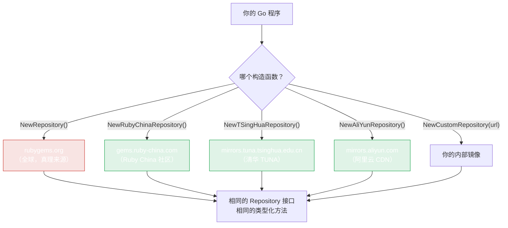

# 镜像

在中国，`rubygems.org` 慢或不可达。rubygems-skills 内置镜像构造函数 —— 接口相同，端点更快，其他代码无需改动。



四个都是同一数据的只读镜像。按你网络的延迟选择 —— 阿里云 CDN 在商业云区域通常最快；TUNA 在校园/学术网络稳定；Ruby China 是社区默认。**镜像是只读的**：写操作（`PushGem`、owners、webhooks）总是通过 `NewWriteRepository` 走官方 `rubygems.org` 端点。

## 内置镜像

| 构造函数 | 服务器 | 运营方 |
|---|---|---|
| `NewRubyChinaRepository()` | `https://gems.ruby-china.com` | Ruby China |
| `NewTSingHuaRepository()` | `https://mirrors.tuna.tsinghua.edu.cn/rubygems/api` | 清华 TUNA |
| `NewAliYunRepository()` | `https://mirrors.aliyun.com/rubygems` | 阿里云 |

```go
import "github.com/scagogogo/rubygems-skills/pkg/repository"

// 选你网络中最快的
repo := repository.NewRubyChinaRepository()

pkg, err := repo.GetPackage(ctx, "rails")  // 调用完全相同
```

三个都返回 `Repository`，是 `NewRepository()` 的直接替代。它们也兼容 `CachedRepository`：

```go
base   := repository.NewRubyChinaRepository()
cached := repository.NewCachedRepository(base, 10*time.Minute, nil)
```

## 自定义镜像 / 自建服务器

有自己的 gem 服务器（Artifactory、Nexus、私有）？用 `NewCustomRepository`：

```go
repo := repository.NewCustomRepository("https://gems.corp.internal")
```

或通过 options 设置 URL，这样可以同时附上 token 和代理：

```go
opts := repository.NewOptions().
    SetServerURL("https://gems.corp.internal").
    SetToken("YOUR_TOKEN")
repo := repository.NewRepository(opts)
```

## 镜像如何工作

镜像只是用不同 `ServerURL` 构建的 `Repository`。每个端点路径（`/api/v1/gems/{name}.json` 等）保持一致 —— 镜像逐字复制 RubyGems.org API 表面。所以方法逻辑没有差异；只有 host 不同。

## 选择镜像

从你的机器测试延迟的快捷方法：

```bash
for url in \
  https://rubygems.org/api/v1/gems/rails.json \
  https://gems.ruby-china.com/api/v1/gems/rails.json \
  https://mirrors.tuna.tsinghua.edu.cn/rubygems/api/v1/gems/rails.json \
  https://mirrors.aliyun.com/rubygems/api/v1/gems/rails.json ; do
  echo -n "$url: "; curl -s -o /dev/null -w "%{time_total}s\n" "$url"
done
```

选数字最小的那个构造函数。

::: tip 镜像是只读的
镜像复制的是公开读 API。写操作（push、yank、owners、webhooks）请用带认证的官方 `rubygems.org` 端点 —— `NewWriteRepository(repository.NewOptions().SetToken(...))`。
:::

---

下一步：[缓存](./caching)。
