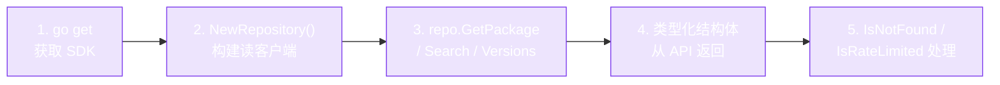

# 快速开始

一分钟内完成你的第一次 RubyGems API 调用。



五步，一个 module，无样板代码。本页每一步都是可直接复制运行的代码。

## 1. 初始化项目

```bash
mkdir myapp && cd myapp
go mod init myapp
go get github.com/scagogogo/rubygems-skills@latest
```

## 2. 查询 gem

创建 `main.go`：

```go
package main

import (
    "context"
    "fmt"
    "log"

    "github.com/scagogogo/rubygems-skills/pkg/repository"
)

func main() {
    ctx := context.Background()
    repo := repository.NewRepository()

    // 获取 gem 的元数据
    pkg, err := repo.GetPackage(ctx, "rails")
    if err != nil {
        log.Fatal(err)
    }
    fmt.Printf("📦 %s %s\n", pkg.Name, pkg.Version)
    fmt.Printf("   Downloads: %d\n", pkg.Downloads)
    fmt.Printf("   Source:     %s\n", pkg.SourceCodeURI)
}
```

```bash
go run main.go
# 📦 rails 7.1.3.4
#    Downloads: 234567890
#    Source:     https://github.com/rails/rails
```

## 3. 列出版本

```go
versions, err := repo.GetGemVersions(ctx, "rails")
if err != nil {
    log.Fatal(err)
}
fmt.Println("Latest 5 versions:")
for i, v := range versions {
    if i >= 5 { break }
    fmt.Printf("  - %s\n", v.Number)
}
```

## 4. 搜索

```go
results, err := repo.Search(ctx, "http client", 1)
if err != nil {
    log.Fatal(err)
}
for _, r := range results {
    fmt.Printf("  - %s: %s\n", r.Name, r.Info)
}
```

## 5. 依赖

```go
deps, err := repo.GetDependencies(ctx, "rails")
if err != nil {
    log.Fatal(err)
}
for _, d := range deps {
    fmt.Printf("  %s is depended on by %s (%s)\n", d.Name, d.DependentName, d.Requirements)
}
```

gem 自身的运行时/开发依赖也可以从 package 结构体获取：

```go
pkg, _ := repo.GetPackage(ctx, "rails")
for _, d := range pkg.Dependencies.Runtime {
    fmt.Printf("  runtime: %s %s\n", d.Name, d.Requirements)
}
```

## 完整示例

完整可运行示例在仓库的 [`examples/basic_usage.go`](https://github.com/scagogogo/rubygems-skills/blob/main/examples/basic_usage.go)。

## 错误处理

用类型化错误检查包装调用，让程序优雅降级：

```go
pkg, err := repo.GetPackage(ctx, "nonexistent-gem-xyz")
switch {
case repository.IsNotFound(err):
    fmt.Println("gem not found")
case repository.IsRateLimited(err):
    fmt.Println("slow down — rate limited")
case repository.IsUnauthorized(err):
    fmt.Println("auth required")
case err != nil:
    log.Fatal(err)
}
```

参见 [错误处理](./error-handling)。

---

下一步：[配置](./configuration)。
