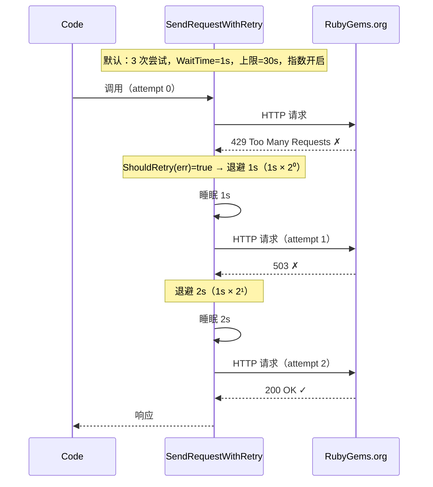

# 重试与退避

瞬态失败是公开 API 的常态 —— 429 限流、瞬时 503、网络抖动。rubygems-skills 用可配置的指数退避重试每个请求。

## 默认值

开箱即用（无配置）：

| 设置 | 值 |
|---|---|
| 最大尝试次数 | 3 |
| 初始等待 | 1s |
| 最大等待（上限） | 30s |
| 指数退避 | 开启 |
| 重试条件 | 任何错误（默认 `ShouldRetry` 是 `err != nil`） |

通常无需改动。

## 调优

```go
import "time"

retry := repository.NewDefaultRetryOptions().
    WithMaxAttempts(6).                  // 最多尝试 6 次
    WithWaitTime(200*time.Millisecond).  // 起始 200ms
    WithMaxWaitTime(5*time.Second).      // 单次等待上限 5s
    WithExponentialBackoff(true).        // 指数增长等待
    WithShouldRetry(func(err error) bool {
        // 自定义谓词 —— 只按你定义的瞬态条件重试
        return repository.IsRateLimited(err)
    })

opts := repository.NewOptions().SetRetryOptions(retry)
repo := repository.NewRepository(opts)
```

| 方法 | 用途 |
|---|---|
| `WithMaxAttempts(n)` | 总尝试次数（含第一次）。 |
| `WithWaitTime(d)` | 第一次重试前的基础等待。 |
| `WithMaxWaitTime(d)` | 单次等待上限（退避不会超过此值）。 |
| `WithExponentialBackoff(bool)` | 指数增长等待（true）或保持恒定（false）。 |
| `WithShouldRetry(fn)` | 判断给定错误是否可重试的谓词。 |
| `DisableRetry()`（在 `Options` 上） | 完全关闭重试。 |

## 工作原理

泛型辅助函数 `SendRequestWithRetry[Request, Response]`（在 `pkg/repository/retry.go`）包装每个 HTTP 调用。遇到可重试错误时，它睡眠退避时长再重试，直到 `MaxAttempts`。尝试之间的等待按 `WaitTime * 2^(attempt-1)` 增长，直到 `MaxWaitTime` 后保持不变。没有 jitter —— 增长是纯指数的。



按默认值，最坏情况的重试序列在三次尝试之间等待 `1s + 2s`（第三次尝试的等待会是 `1s × 2² = 4s`，但已是最后一次尝试，所以不再等待）。上限（`MaxWaitTime = 30s`）只在长重试链且 `MaxAttempts` 较高时才生效。

两个类型参数是：`Request`（请求体类型，底层 `go-requests` 的 `Options[Request, Response]` 使用）和 `Response`（解码后的响应类型）。重试循环本身只对 `error` 分支，所以它与 HTTP 无关 —— 任何非 2xx 状态码在重试决策前由响应处理器转为错误。

重试是透明的 —— 如果所有尝试都失败，你收到最终错误，包装为 `max retry attempts reached (N attempts): <last error>`（通常是 `*repository.APIError`，可用 `IsRateLimited` / `IsUnauthorized` / `IsNotFound` 检查）。

::: warning 默认重试所有错误 —— 包括 404 和 401
默认 `ShouldRetry` 对任何非 nil 错误返回 `true`。这意味着 404（缺失 gem）或 401（错误 token）**会**被重试到 `MaxAttempts`，对不会自愈的情况浪费时间和限流配额。如果你调用 404/401 是预期结果的端点，请提供更严格的谓词：

```go
retry := repository.NewDefaultRetryOptions().WithShouldRetry(func(err error) bool {
    // 重试限流和服务器错误，但不重试「未找到」或「未授权」
    return !repository.IsNotFound(err) && !repository.IsUnauthorized(err)
})
```
:::

## 禁用重试

对于应快速失败的即发即弃脚本：

```go
opts := repository.NewOptions().DisableRetry()
repo := repository.NewRepository(opts)
```

## 重试何时有用（何时没用）

- **有用：** 429 限流、502/503 网关抖动、瞬态 DNS/TLS 故障。
- **默认没用：** 404 未找到（缺失的 gem 重试也不会出现）和 401 未授权（错误 token 一直是错的）。默认 `ShouldRetry` 仍会重试这些 —— 如果你想对这类情况快速失败，请提供排除 `IsNotFound` / `IsUnauthorized` 的谓词（见上方警告）。

---

下一步：[批量操作](./bulk-operations)。
