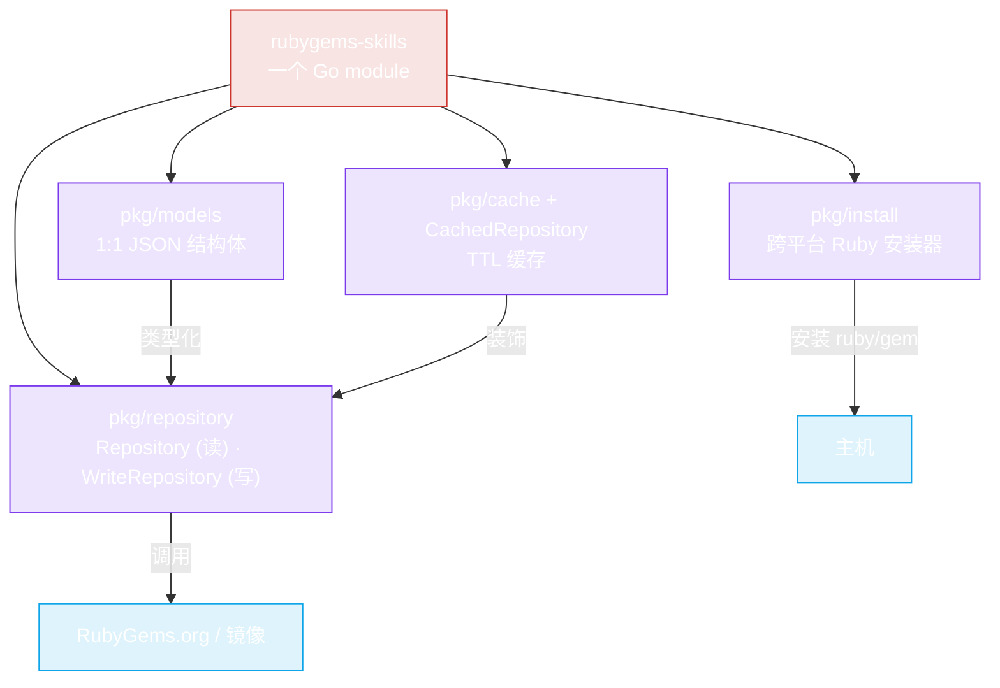

# 什么是 rubygems-skills？

**rubygems-skills** 是一个面向 [RubyGems.org](https://rubygems.org) HTTP API 的生产级 Go SDK。它将每个读和写端点封装为类型化的 Go 接口，让你 —— 或你的 AI agent —— 可以查询、搜索和发布 gem，无需手写 HTTP 客户端。

## 一览



| 能力 | 包 | 接口 |
|---|---|---|
| 读操作（无需认证） | `pkg/repository` | `Repository` |
| 写操作（需要认证） | `pkg/repository` | `WriteRepository` |
| 跨平台安装 | `pkg/install` | `Installer` |
| 数据模型 | `pkg/models` | 结构体 |
| 缓存 | `pkg/cache` / `pkg/repository` | `CachedRepository` |

```go
import "github.com/scagogogo/rubygems-skills/pkg/repository"

repo := repository.NewRepository()
pkg, err := repo.GetPackage(ctx, "rails")
```

## 为什么还需要一个 SDK？

RubyGems.org API 没有官方 Go 客户端。当你让 AI agent "使用 RubyGems" 时，它会临时拼凑一个脆弱的 HTTP 客户端 —— 猜测 JSON 结构、忽略限流、在瞬态错误上失败。**rubygems-skills 用一个类型化、测试完备的模块替代了那种临时拼凑。**

完整理由请阅读 [为什么选择它？](./why)。

## 目标用户

- **AI 编程 Agent**（Claude Code、Codex、Cursor）需要一个可靠、自文档化的 RubyGems API 表面。
- **Go 开发者** 构建 Ruby 生态周边工具（依赖分析、审计脚本、镜像、CI 机器人）。
- **中国用户** 需要镜像支持（Ruby China、清华、阿里云）以实现快速、GFW 友好的访问。

## Module 路径

```
github.com/scagogogo/rubygems-skills
```

需要 **Go 1.21+**（使用泛型实现 `getJson[T]` 和 `runWorkerPool[T]`）。