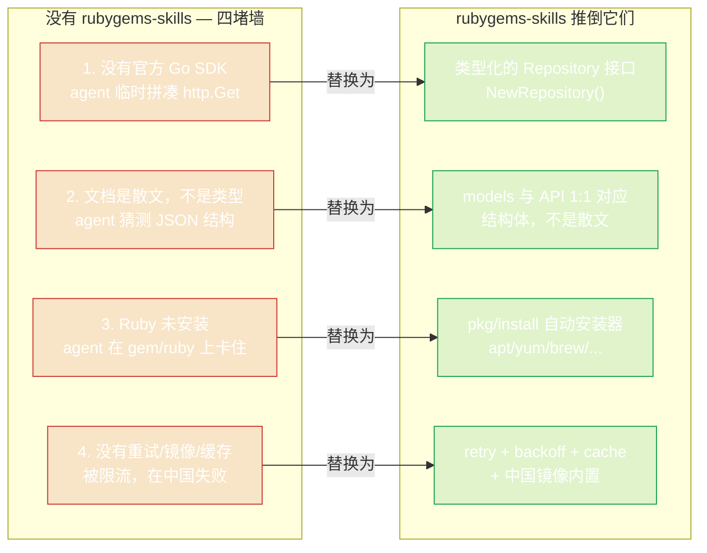

# 为什么选择它？

AI 编程 agent 擅长写 Go。但当你让它「使用 RubyGems API」时，它每次都会撞上同样的四堵墙。**rubygems-skills 的存在就是为了推倒这些墙。**

## 四堵墙



### 1. 没有官方 Go SDK

官方 RubyGems 生态以 Ruby 为中心（`gem`、Bundler、`rubygems.org` API 文档为 Ruby HTTP 客户端编写）。**没有第一方的 Go module**。

于是 AI agent 只能临时拼凑：写 `http.Get(url)`，从散文示例猜测 JSON 结构，发布一个半残的客户端。结果：

- 字段名错误（`downloads` vs `downloads_count`）。
- 搜索缺少分页处理。
- 不处理 `429 Too Many Requests`。
- 约 50 行脆弱的粘合代码，API 一加字段就崩。

**rubygems-skills** 用 `repo.GetPackage(ctx, "rails")` 返回 `*models.PackageInformation` 替代这一切 —— 一个精确映射 API JSON schema 的结构体。

### 2. API 文档是散文，不是类型

[RubyGems.org API 文档](https://guides.rubygems.org/rubygems-org-api/) 用英文句子描述端点。agent 必须：

1. 阅读人类散文。
2. 在脑海中翻译成 Go 结构体。
3. 祈祷字段名猜对了。

这既慢又容易出错。**rubygems-skills 把类型作为真理来源。** `pkg/models` 包是 API JSON 到 Go 结构体的 1:1 映射。agent 读的是 Go，不是散文 —— 而 Go 没有歧义。

### 3. Ruby/RubyGems 可能未安装

很多工作流不只是调用 API —— 还需要运行 `gem`、`bundle` 或 `ruby`（例如发布前构建 `.gem` 文件，或解析本地 Gemfile）。在全新的 CI runner 或容器里，这些二进制不存在，agent 就卡住了。

**rubygems-skills 包含 `pkg/install`** —— 一个跨平台自动安装器。一次调用检测 OS 和包管理器，然后通过 `apt`、`yum`、`dnf`、`apk`、`pacman`、`brew`、`choco`、`scoop` 或 `zypper` 安装 Ruby + RubyGems。已在 Docker 中测试 Ubuntu、Debian、Alpine、Fedora 和 Rocky Linux。

```go
installer := install.NewInstaller()
result, err := installer.Install(ctx)
```

参见 [自动安装](../auto-install/overview)。

### 4. 限流、镜像、重试是事后才想的

RubyGems.org 强制限流（有 API token 时更高）。手写的客户端：

- 被限流后崩溃。
- 一次瞬态 503 就失败。
- 在中国无法使用，`rubygems.org` 慢或被墙。

**rubygems-skills 三者都处理：**

- **指数退避重试** —— 通过 `RetryOptions` 配置，在 429/5xx 时重试。
- **批量操作** —— 并发 worker pool，一次获取多个 gem。
- **镜像支持** —— `NewRubyChinaRepository()`、`NewTSingHuaRepository()`、`NewAliYunRepository()` 给你快速、GFW 友好的端点。

## 设计收益

因为 SDK 完全类型化且自描述，AI agent 可以**第一次就写出正确的代码**。对比：

::: details 手写（agent 没有这个 SDK 时写的）
```go
// ~40 行，无重试，无缓存，字段名可能错
resp, err := http.Get("https://rubygems.org/api/v1/gems/rails.json")
// ... 手动 JSON 解析到猜测的结构体 ...
// ... 无限流处理，无镜像，在中国失败 ...
```
:::

::: details 用 rubygems-skills
```go
repo := repository.NewRepository()
pkg, err := repo.GetPackage(ctx, "rails")
// pkg.Name, pkg.Version, pkg.Downloads —— 类型化、已缓存、已重试、可镜像
```
:::

第二种是 agent 知道 SDK 存在时生成的代码。**这个网站的职责就是确保 agent 知道。**

---

下一步：[工作原理](./how-it-works) —— 内部架构。
