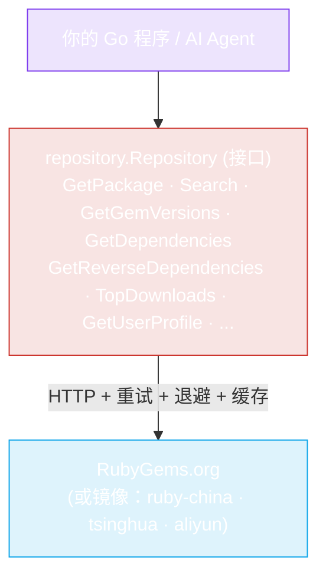

## 🎯 给 AI Agent 的 30 秒简介

::: tip 一个提示词搞定一切
复制下面的代码块，粘贴到 **Claude Code** 或 **Codex**，替换描述你需求的那一行 —— 然后坐等。Agent 会安装 SDK、阅读本站文档（如果需要）、编写代码、处理错误并运行给你看。
:::

```
使用 rubygems-skills Go SDK (github.com/scagogogo/rubygems-skills) 在本项目
中与 RubyGems.org API 交互。

我要做的事：
<用一行描述你的任务 —— 例如 "获取 rails gem 和它最近的 5 个版本"、
"发布 mygem-0.1.0.gem"、"批量审计这 20 个 gem"。>

具体步骤（严格按此执行）：
1. 添加依赖：go get github.com/scagogogo/rubygems-skills@latest
2. 仅当你不知道某个方法或字段名时，阅读 SDK 官方文档
   https://scagogogo.github.io/rubygems-skills/zh/（或本站的 /ai-agents
   和 /api 页面）。大多数任务只需要这些关键信息：
     - 读客户端：repo := repository.NewRepository()
     - 写客户端：w := repository.NewWriteRepository(
                   repository.NewOptions().SetToken(os.Getenv("RUBYGEMS_API_KEY")))
     - 数据结构在 pkg/models，与 API JSON 1:1 对应。
     - 错误助手：repository.IsNotFound / IsRateLimited / IsUnauthorized。
     - 中国镜像：repository.NewRubyChinaRepository() 等。
     - 如果 ruby/gem 未安装且你的任务需要运行它们，用
       install.NewInstaller().Install(ctx)（来自 pkg/install）自动安装。
3. 为我的任务编写地道 Go 代码。用上面的助手处理错误。
   不要硬编码 URL —— 使用构造函数。
4. 运行 `go run .`（或 `go run main.go`）并展示输出。
5. 如果构建或运行失败，阅读错误、修复代码并重新运行。
   持续迭代直到成功。不要在第一个错误处停下。

如果任务需要认证（发布、所有者、webhook），在步骤 4 前让我设置
RUBYGEMS_API_KEY 环境变量。否则直接执行，不要询问。
```

::: warning 只需粘贴等待
你不需要阅读任何其他文档。Agent 会在需要时阅读本站、理解 SDK、编写代码、安装依赖、运行、自我修复错误并展示结果。**复制 → 粘贴 → 完成。**
:::

### 想要特定的现成提示词？

[复制粘贴提示词](./ai-agents/prompts) 页面有针对具体任务的代码块 —— 初始化查询、批量获取多个 gem、发布 `.gem`、自动安装 Ruby、管理 webhook、运行依赖审计 —— 每个都调优好，Agent 无需任何澄清。

[**→ 获取完整提示词集合**](./ai-agents/prompts){.prompt-card}

---

## 解决了什么问题？

AI 编程 Agent（Claude Code、Codex、Cursor 等）擅长写 Go —— 但当你让它们 "使用 RubyGems API" 时，每次都会碰上同样的墙：

1. **不存在官方 Go SDK。** Agent 从零发明一个半残的 HTTP 客户端、猜测 JSON 结构、在试错上浪费 token。
2. **官方 API 文档是散文，不是类型。** Agent 必须阅读人类文档并翻译成 Go 结构体 —— 容易出错且缓慢。
3. **Ruby/RubyGems 可能未安装。** 当 Agent 的流程实际需要运行 `gem` 或 `ruby` 时，因为机器上没有二进制而卡住。
4. **限流、镜像和重试是事后补救。** 手写的客户端会撞限流、在瞬态错误上失败、在中国 GFW 后无法使用。

**rubygems-skills 用一个类型化、测试完备、Agent 友好的模块解决了这四个问题。**

[**→ 阅读完整的"为什么"分析**](./guide/why)

---

## 工作原理



SDK 把每个 RubyGems HTTP 端点变成一个 **类型化的 Go 接口方法**。你调用 `repo.GetPackage(ctx, "rails")`，返回一个 `*models.PackageInformation` 结构体 —— 无需 JSON 解析、无需 URL 构建、无需猜测错误码。

对于写操作（发布、撤回、所有者、webhook），`WriteRepository` 接口封装了认证端点。而 `pkg/install` 提供跨平台自动安装器，让 Agent 在需要时可以自行安装 Ruby。

[**→ 深入了解架构**](./guide/how-it-works)

---

## 从这里开始

<CardGrid>
  <Card title="🤖 AI Agent 指南" icon="robot" link="./ai-agents/claude-code">
    分步教程：Claude Code 和 Codex 如何发现并使用这个 SDK。包含可直接粘贴的提示词。
  </Card>
  <Card title="🚀 快速入门" icon="rocket" link="./guide/quick-start">
    添加依赖并在一分钟内完成第一个 API 调用。
  </Card>
  <Card title="📖 API 参考" icon="book" link="./api/repository">
    每个方法、每个签名、每个端点 —— 机器可读的地图。
  </Card>
  <Card title="🛠️ 命令行工具" icon="terminal" link="./cli/install">
    从命令行查询 RubyGems。一个参数自动安装 Ruby。
  </Card>
</CardGrid>